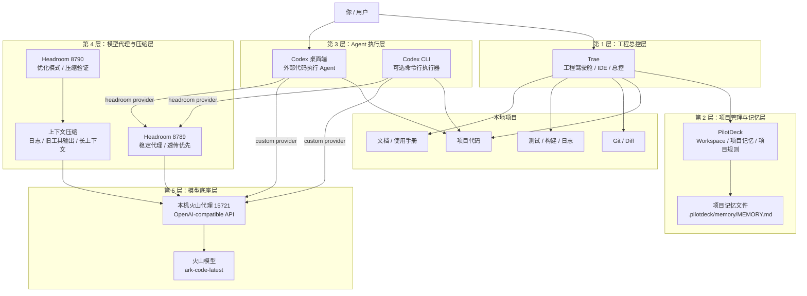
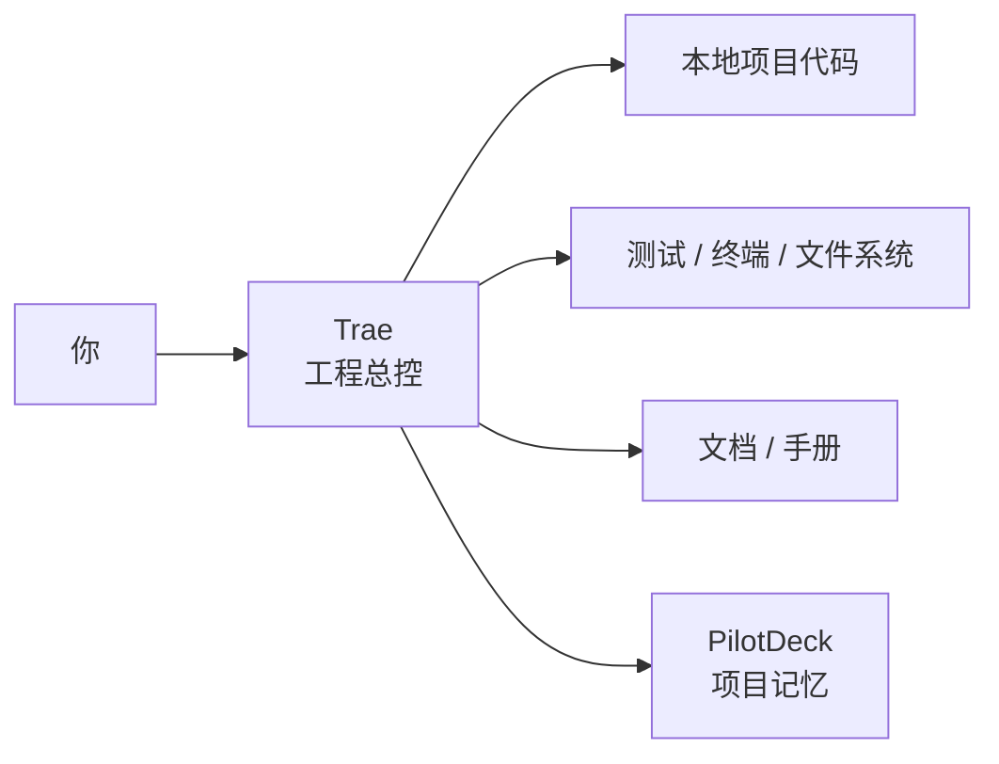
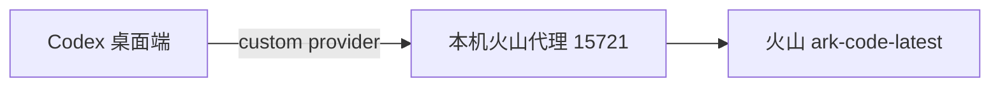
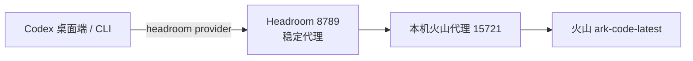
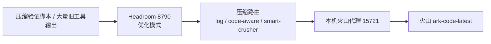
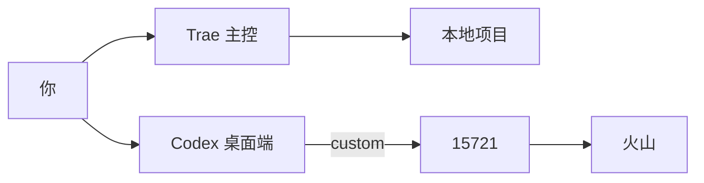
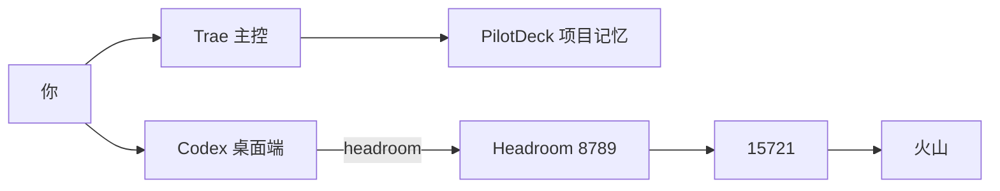
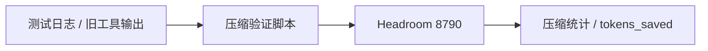
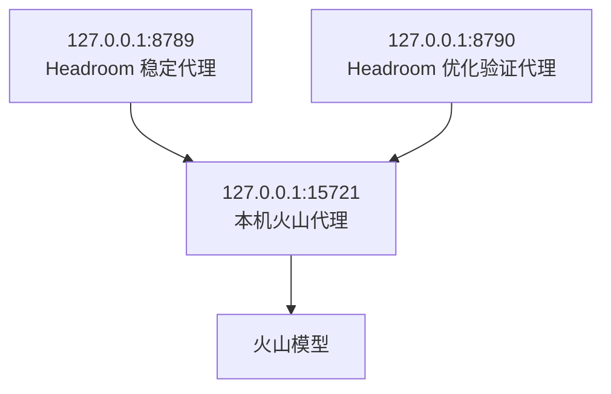

# Trae + PilotDeck + Codex + Headroom + 火山工具架构图

更新时间：2026-06-13

## 1. 总体定位

这套工具链不是把所有工具放在同一层，而是分成五层：

```text
第 1 层：人机交互与工程总控层
第 2 层：项目管理与记忆层
第 3 层：Agent 执行层
第 4 层：模型代理与压缩层
第 5 层：模型底座层
```

一句话总结：

```text
Trae 是主控台，PilotDeck 管项目记忆，Codex 是辅助执行器，Headroom 管模型代理和压缩，火山提供底层模型能力。
```

## 2. 总体架构图



## 3. 日常稳定链路

日常稳定开发建议优先使用这两条链路。

### 3.1 Trae 主控链路



用途：

```text
1. 打开项目
2. 修改代码
3. 跑测试
4. 排查环境
5. 管理文档
6. 编排其他工具
```

### 3.2 Codex 直连火山链路



用途：

```text
1. 稳定代码任务
2. 小范围修复
3. 只读代码分析
4. 不需要 Headroom 压缩时
```

对应配置：

```text
$HOME/.codex/config.toml
model_provider = "custom"
base_url = "http://127.0.0.1:15721/v1"
```

## 4. Headroom 代理链路

### 4.1 稳定代理链路 8789



用途：

```text
1. 让 Codex 请求统一经过 Headroom
2. 为后续观测、压缩、审计做准备
3. 日常可作为稳定代理使用
```

对应配置：

```text
$HOME/.codex/config.toml
[model_providers.headroom]
base_url = "http://127.0.0.1:8789/v1"
```

### 4.2 压缩验证链路 8790



用途：

```text
1. 验证 Headroom 压缩收益
2. 压缩重复日志
3. 压缩旧工具输出
4. 观察 token 节省效果
```

已验证收益：

```text
重复日志工具输出：60274 tokens -> 287 tokens
节省：59987 tokens
压缩收益：99.52%
```

## 5. 工具职责边界

| 工具 | 所在层级 | 核心职责 | 不负责什么 |
|---|---|---|---|
| Trae | 工程总控层 | 项目开发、文件编辑、终端执行、测试、文档、协调工具 | 不专门作为模型代理 |
| PilotDeck | 项目记忆层 | Workspace、项目规则、项目上下文记忆 | 不执行代码、不转发模型请求 |
| Codex 桌面端 | Agent 执行层 | 独立执行代码任务、读代码、改代码、解释代码 | 不管理长期项目记忆 |
| Codex CLI | Agent 执行层 | 命令行方式执行 Codex 任务 | 日常桌面端用户不必常用 |
| Headroom 8789 | 代理层 | 稳定转发到火山代理 | 不直接编辑代码 |
| Headroom 8790 | 代理/压缩层 | 压缩验证、观测 token 收益 | 不作为最稳日常链路 |
| 本机火山代理 15721 | 模型接入层 | OpenAI-compatible 火山入口 | 不做项目管理 |
| 火山 ark-code-latest | 模型底座层 | 提供模型推理能力 | 不直接操作本地文件 |

## 6. 推荐使用模式

### 6.1 日常默认模式



推荐场景：

```text
普通开发、读代码、小范围修复、补测试。
```

### 6.2 多轮复杂任务模式



推荐场景：

```text
大项目诊断、多轮读文件、多步修复、希望统一经过 Headroom。
```

### 6.3 压缩收益验证模式



推荐场景：

```text
验证 Headroom 对日志、旧工具输出、重复上下文的压缩效果。
```

## 7. 当前本机端口图



端口说明：

```text
15721：必须存在，是模型上游入口
8789：Codex headroom provider 使用
8790：压缩 benchmark 和收益验证使用
```

## 8. 文件关系图

```mermaid
flowchart TD
    CodexConfig[$HOME/.codex/config.toml]
    Manual[<repo-root>/docs/usage/codex-headroom-volcengine-usage-manual.md]
    Arch[<repo-root>/docs/architecture/agentops-tools-architecture.md]
    Workflow[<repo-root>/docs/architecture/agentops-workflow-design.md]
    Start8790[<repo-root>/headroom/servers/start_headroom_direct.py]
    Bench[<repo-root>/headroom/benchmarks/headroom_tool_output_compress_bench.py]
    Memory[/path/to/your/workspace/.pilotdeck/memory/MEMORY.md]

    CodexConfig --> ProviderCustom[custom provider -> 15721]
    CodexConfig --> ProviderHeadroom[headroom provider -> 8789]
    Start8790 --> HR8790[启动 8790]
    Bench --> HR8790
    Manual --> Arch
    Workflow --> Arch
    Memory --> PilotDeck[PilotDeck 项目记忆]
```

## 9. 最终结论

```text
Trae：主控台，负责工程操作和协调
PilotDeck：项目记忆，负责让工具知道项目规则
Codex：执行器，负责独立完成代码任务
Headroom：模型代理和压缩层，负责转发与 token 优化
火山：模型底座，负责推理能力
```

推荐你以后按这个方式理解：

```text
Trae 管全局，Codex 做辅助执行，PilotDeck 管记忆，Headroom 管模型链路，火山提供模型能力。
```
